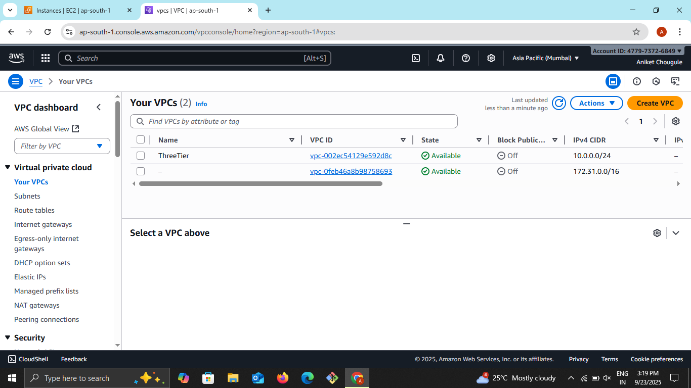
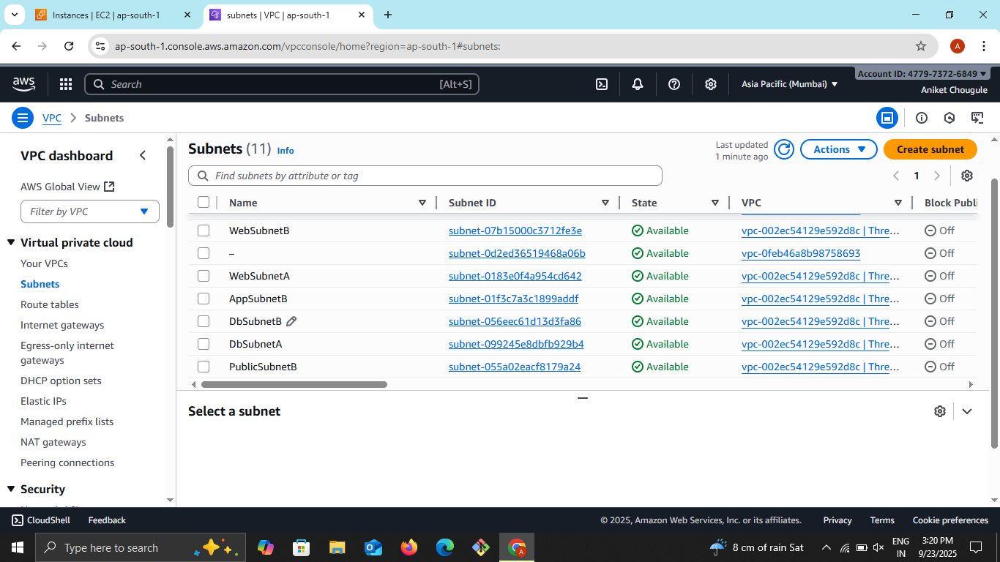
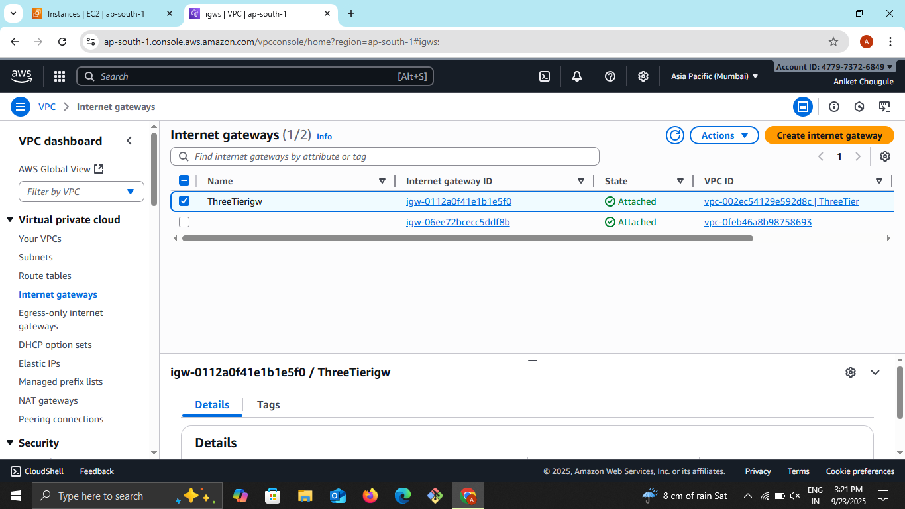
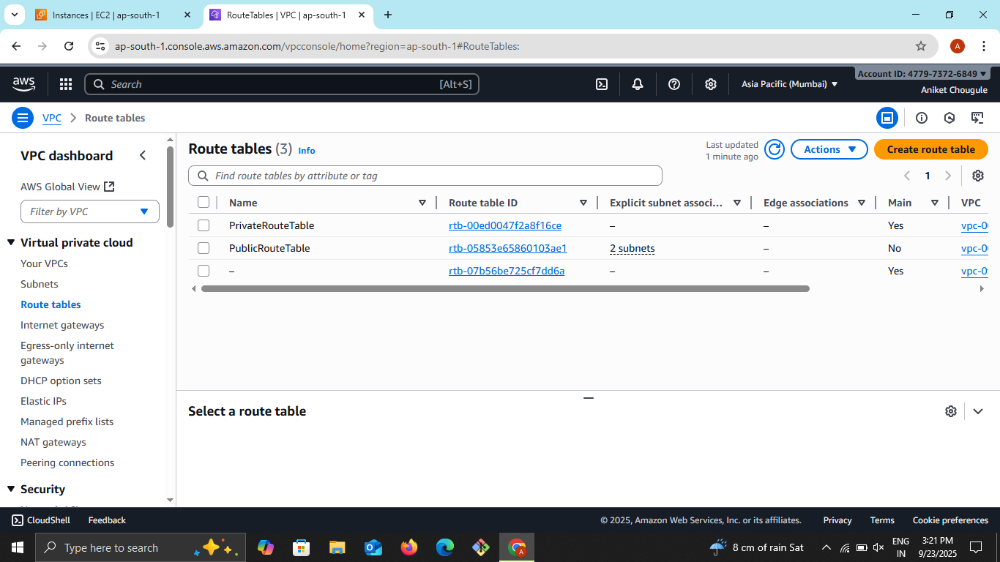
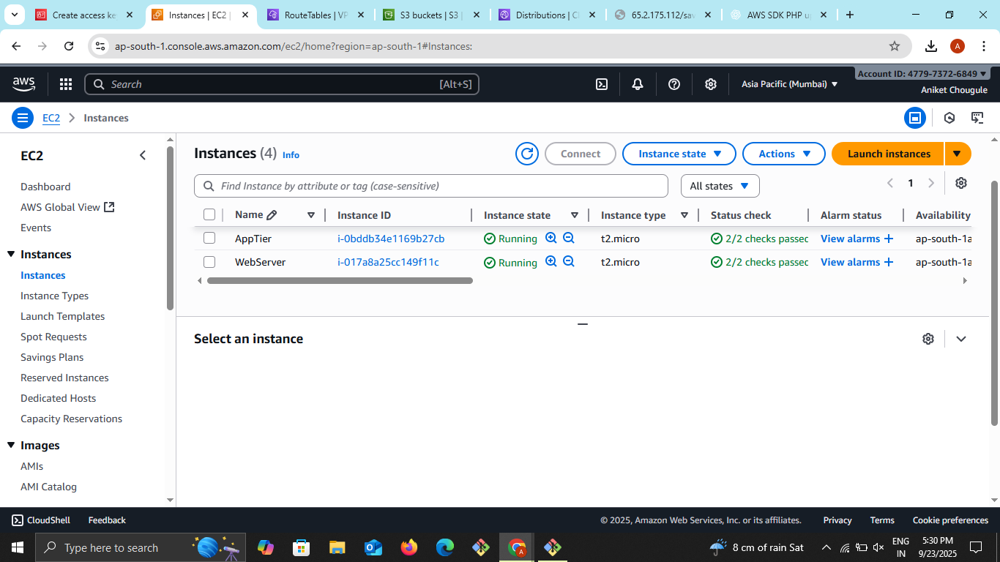
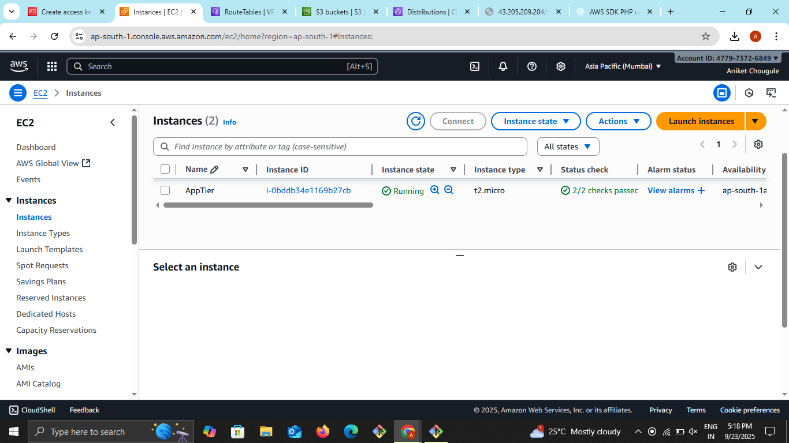
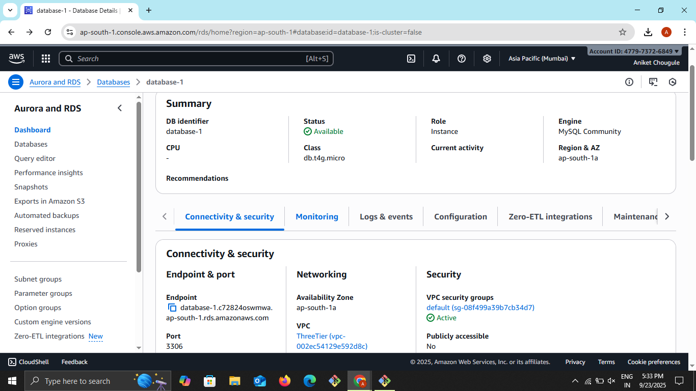
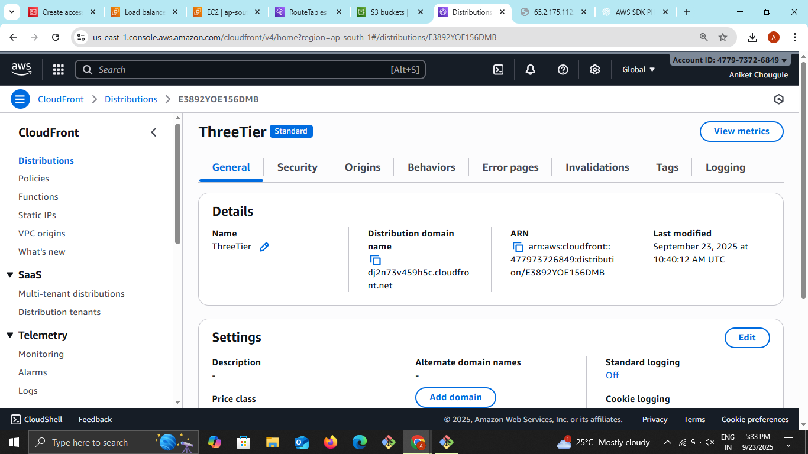
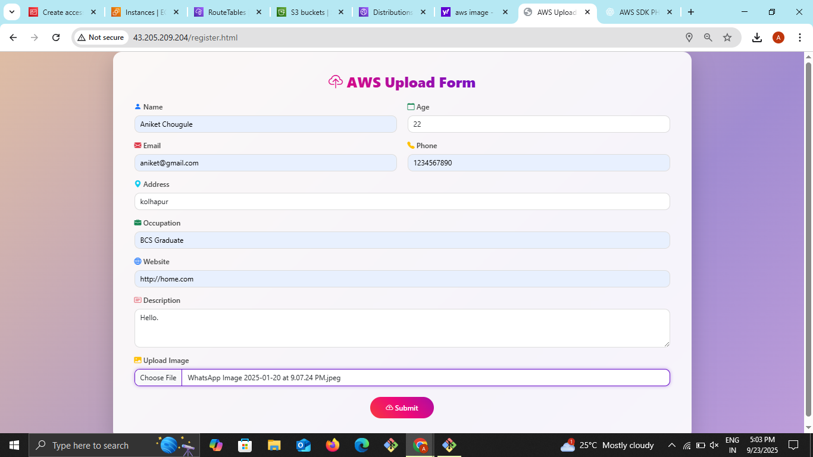
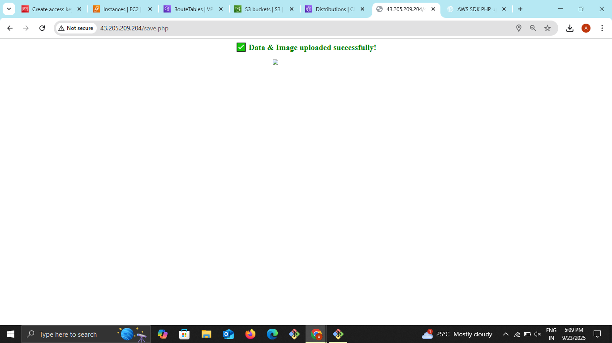

# Three-Tier Architecture on AWS
This project implements a scalable and secure three-tier web application architecture on Amazon Web Services (AWS), consisting of web, application, and database tiers.

--- 

## 1. Architecture Overview

The three-tier architecture separates concerns into distinct layers:

* **Web Tier** : Handles HTTP requests, serves static content, and routes dynamic requests to the application tier
* **Application Tier** : Processes business logic and communicates with the database tier
* **Database Tier** : Manages data storage and retrieval using MySQL

<table border="1" cellpadding="6" cellspacing="0">
  <tr>
    <th>🏷️ Tier</th>
    <th>🎯 Purpose</th>
    <th>🌐 Subnet Type</th>
    <th>📝 Language / Stack</th>
    <th>⚙️ EC2 Role</th>
  </tr>
  <tr>
    <td>Tier 1</td>
    <td>🌍 Frontend (UI)</td>
    <td>🟢 Public Subnet</td>
    <td>HTML, CSS, JS, NGINX</td>
    <td>Handles browser requests</td>
  </tr>
  <tr>
    <td>Tier 2</td>
    <td>🖥️ Application (Logic)</td>
    <td>🔒 Private Subnet</td>
    <td>PHP, NGINX</td>
    <td>Executes business logic</td>
  </tr>
  <tr>
    <td>Tier 3</td>
    <td>💾 Database (Storage)</td>
    <td>🔒 Private Subnet</td>
    <td>MySQL Database</td>
    <td>Stores persistent data</td>
  </tr>
</table>

---

## 2. VPC & Subnet Setup

### 2.1 Create a VPC
* **Name** : `ThreeTier`
* **CIDR block** : `10.0.0.0/16`
* **DNS Hostnames**: Enabled

### 2.2 Create Subnets
<table border="1" cellspacing="0" cellpadding="4">
<tr>
<th>📝 Subnet Name</th>
<th>🌍 CIDR Block</th>
<th>🗺️ Availability Zone (AZ)</th>
<th>🔐 Type</th>
</tr>
<tr>
<td>Public-Subnet</td>
<td>10.0.16.0/24</td>
<td>ap-south-1a</td>
<td>🌐 Public</td>
</tr>
<tr>
<td>Private-App</td>
<td>10.0.32.0/24</td>
<td>ap-south-1a</td>
<td>🔒 Private</td>
</tr>
<tr>
<td>Private-DB</td>
<td>10.0.48.0/24</td>
<td>ap-south-1a</td>
<td>🔒 Private</td>
</tr>
<tr>
<td>Private-DB-2</td>
<td>10.0.64.0/24</td>
<td>ap-south-1b</td>
<td>🔒 Private</td>
</tr>
</table>

> Enable Auto-Assign Public IP for Public Subnet.

### 2.3 Create Internet Gateway
* **Name** : `Three_tierigw`
* **Attach** to `Threetier`

### 2.4 Create Route Tables
**a. Public Route Table**  
* **Name** : `Three_tier`  
* **Associate with** : `Public-Subnet`  
* **Add Route** :
`0.0.0.0/0` ➜ Internet Gateway

**b. Private Route Table**  
* **Name** : `Three_tier`  
* **Associate with** : `Private-App`, `Private-DB`  
* No external route initially.

---

## 3. NAT Gateway Setup
**Why NAT?**  

Private subnets need NAT to access the internet for updates/installations.

**Steps**

1. Allocate Elastic IP  
2. Create NAT Gateway  
   * Subnet : Public-Subnet
   * Elastic IP : Use the one created above
   * Name : SpringBoot-NATGW  
3. Update Private Route Table 
    * Add Route :
0.0.0.0/0 ➜ NAT Gateway

---

## 4. Web Tier Components

The web tier consists of :

* Auto-scaling group of EC2 instances running
* web servers
Internet-facing Application Load Balancer
* Custom AMI for consistent deployment

---

## 5. Application Tier Components

The application tier includes :

* Internal Application Load Balancer
* Auto-scaling group of application servers
* Custom AMI with application code

---

## 6. Database Tier
* Launched an RDS MySQL instance (database-1) in private subnets
* Configured security groups to allow access only from the application tier
* Set up the database connection string for application use

---

## 7. Content Delivery and Storage
For performance and scalability, we implemented :
* CloudFront distribution for content delivery  
* S3 buckets for image storage

 

---

## 🛡️ 8. Security Groups

Security Groups act as virtual firewalls to control inbound and outbound traffic for each tier.
Below is the configuration for Web, App, and Database layers.  

### 📋 Security Group Configuration
<table border="1" cellspacing="0" cellpadding="4">
  <tr>
    <th>🔐 SG Name</th>
    <th>🖥️ Attached To</th>
    <th>🚪 Inbound Rules</th>
    <th>🌍 Outbound</th>
  </tr>
  <tr>
    <td>Web</td>
    <td>Frontend EC2</td>
    <td>22 (SSH), 80 (HTTP) — Anywhere (0.0.0.0/0)</td>
    <td>All Traffic</td>
  </tr>
  <tr>
    <td>App</td>
    <td>Web Server (Tier 2)</td>
    <td>22 (SSH) — From Web SG only</td>
    <td>All Traffic</td>
  </tr>
  <tr>
    <td>DB-RDS</td>
    <td>Database (Tier 3)</td>
    <td>3306 (MySQL) — From App SG only</td>
    <td>All Traffic</td>
  </tr>
</table>

### Security Considerations
* Database instances are in private subnets with no public access
* Application tier is behind an internal load balancer
* Security groups restrict traffic between tiers
* NAT Gateway provides controlled outbound internet access

---

## 9. Performance Features
* Auto-scaling groups ensure capacity meets demand
* Load balancers distribute traffic evenly
* CloudFront provides global content delivery
* Multi-AZ deployment ensures high availability

---

## 10. Usage
The application supports image uploads which are:

1. Stored in S3 buckets for durability
2. Metadata is saved in the MySQL database
3. Distributed via CloudFront for fast global access

---

## 11. Monitoring
All components are configured with appropriate monitoring and logging to ensure operational visibility and quick troubleshooting.

---

## 12. Conclusion
This three-tier architecture on AWS provides a scalable, secure, and highly available foundation for web applications, following AWS best practices for cloud infrastructure.