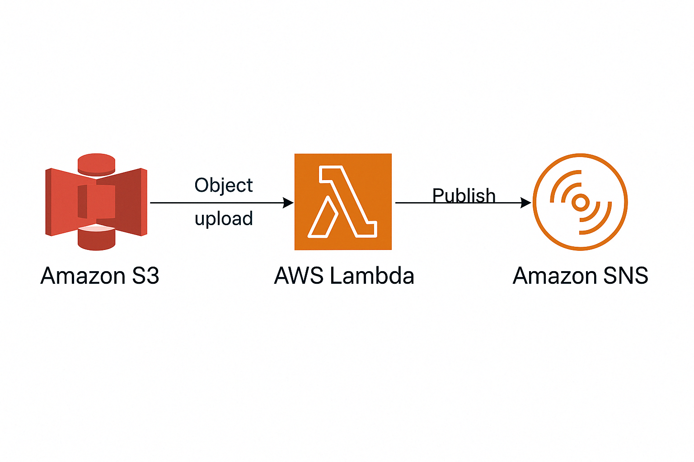
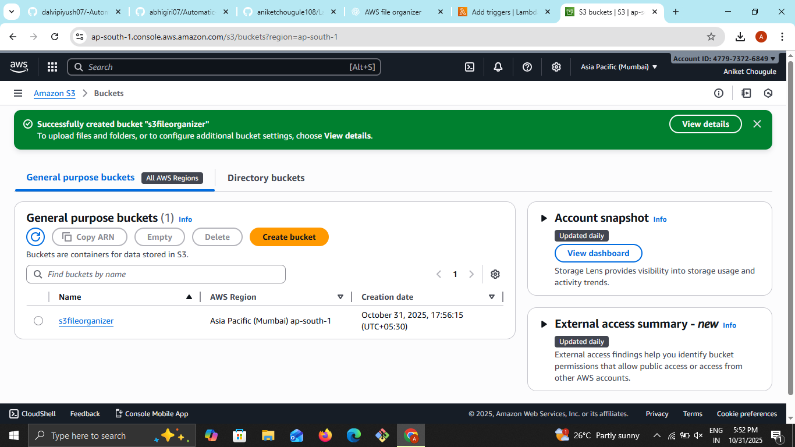
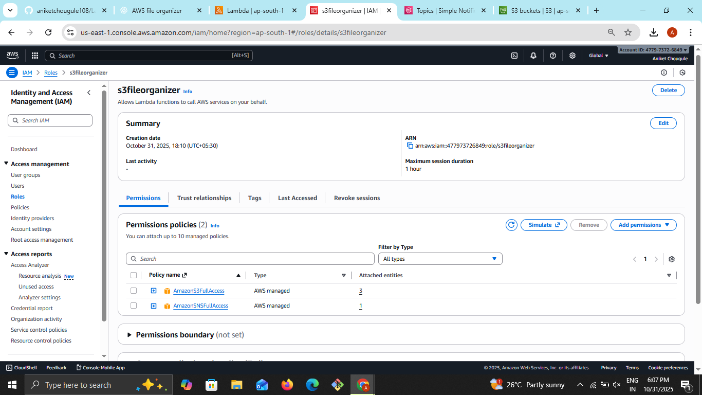
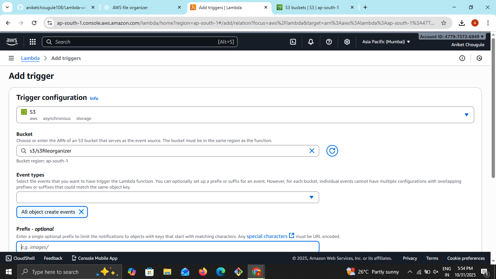
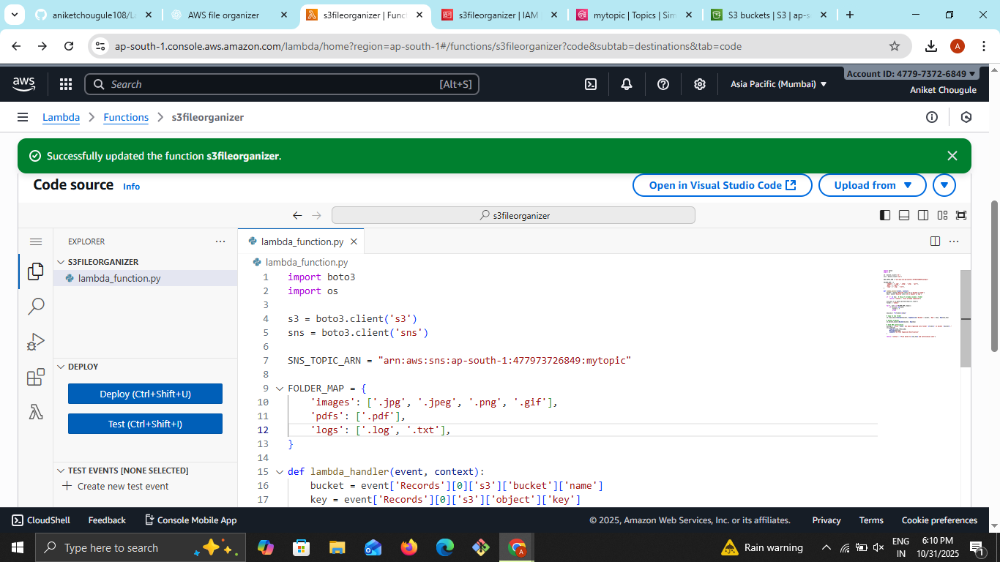
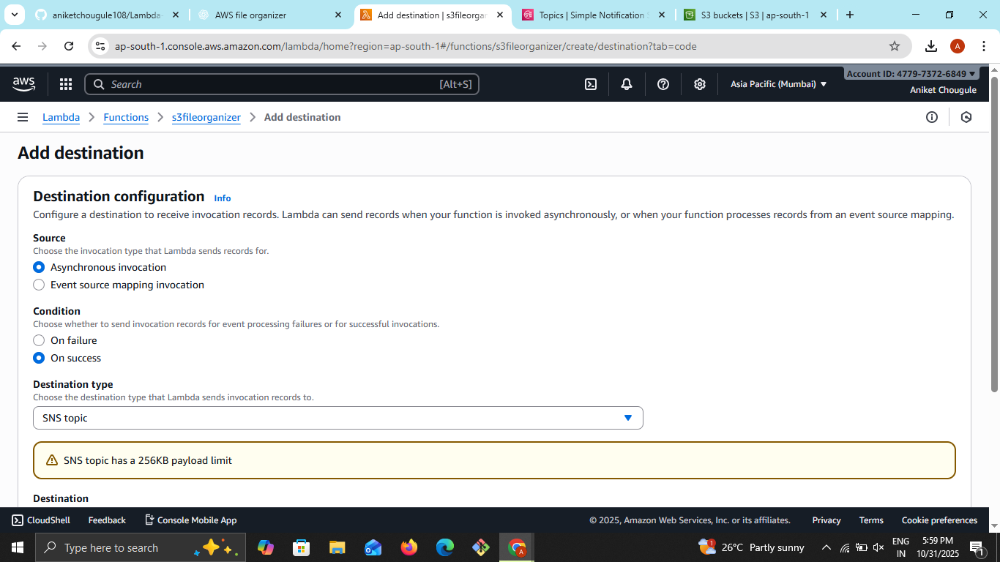
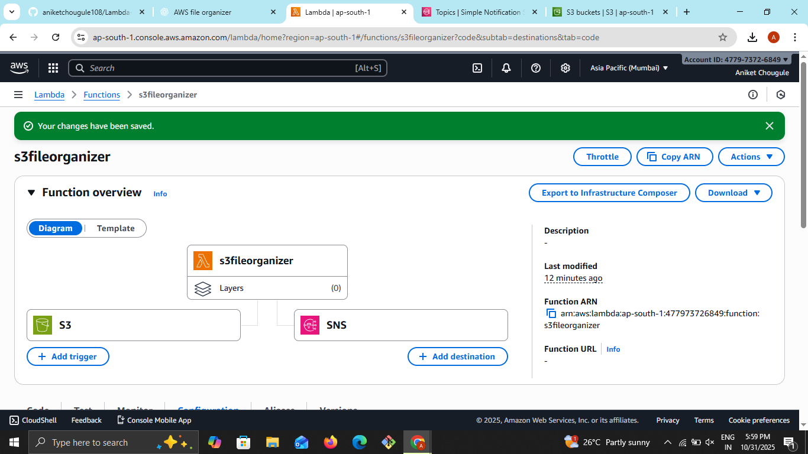
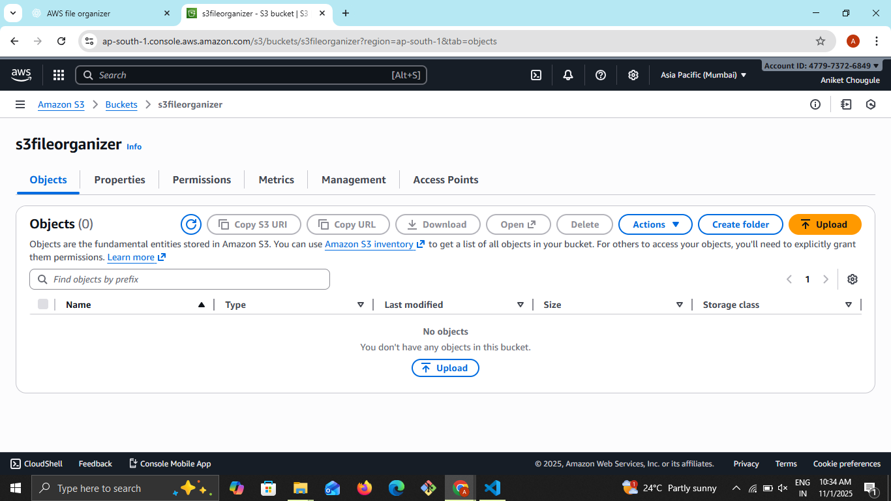
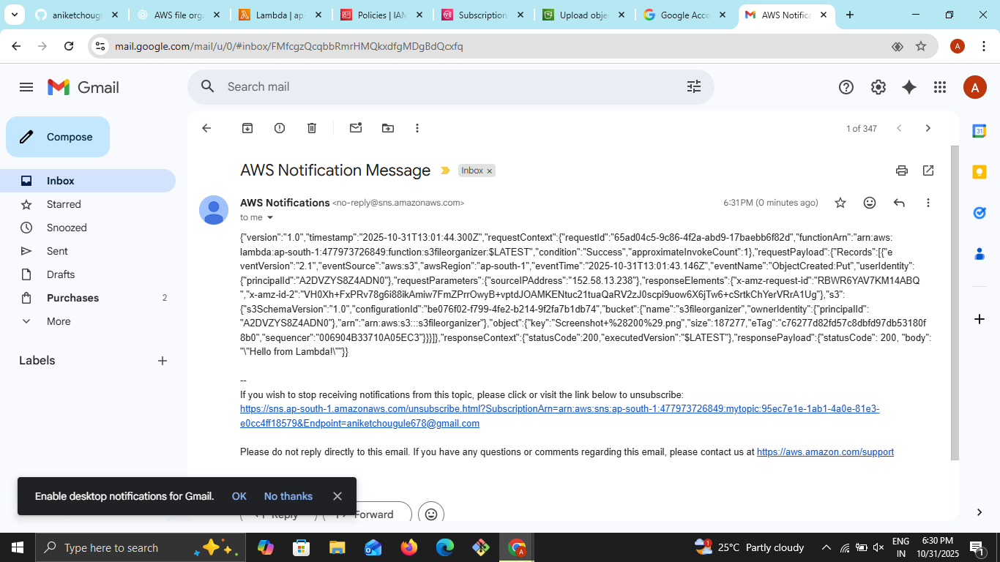

# 🚀 AWS Serverless Automatic File Organizer using S3 + Lambda + SNS
## 📂 Project Overview
This project demonstrates a serverless file management system built on AWS.
Whenever a user uploads a file to an S3 bucket, an AWS Lambda function is triggered.
The Lambda function:

1. Detects the file type (e.g., image, PDF, log, text, etc.)
2. Moves it to the correct folder inside the bucket (images/, pdfs/, logs/, others/)
3. Sends an SNS notification (email or SMS) to inform the user/admin about the organized file

---

## 🔁 Architecture Workflow

1️⃣ User uploads a file to S3  
2️⃣ S3 triggers Lambda event  
3️⃣ Lambda:
* Reads file extension
* Moves file to correct folder
* Publishes notification to SNS  

4️⃣ SNS sends alert to subscriber (admin/user)

### 🧩 AWS Services Used
<table border="1" cellspacing="0" cellpadding="8">
  <thead>
    <tr>
      <th>Service</th>
      <th>Role</th>
    </tr>
  </thead>
  <tbody>
    <tr>
      <td>Amazon S3</td>
      <td>Storage & event source (Stores files and triggers Lambda)</td>
    </tr>
    <tr>
      <td>AWS Lambda</td>
      <td>File type detection + folder organization (Automatically moves files to correct folders)</td>
    </tr>
    <tr>
      <td>Amazon SNS</td>
      <td>Notifications (Email/SMS/Slack) after file organization</td>
    </tr>
    <tr>
      <td>IAM</td>
      <td>Secure access permissions for AWS services</td>
    </tr>
    <tr>
      <td>CloudWatch</td>
      <td>Logs & monitoring of Lambda function and events</td>
    </tr>
  </tbody>
</table>

---

## 🛠️ Step-by-Step Implementation
### ✅ Step 1 – Create S3 Bucket  
Go to AWS S3 → Create bucket → Example: `fileorganizer.`

---

### ✅ Step 2 – Create SNS Topic
* Go to SNS → Create topic → Standard → Name: FileOrganizerNotifications
* Create a subscription (Email or SMS).
* Confirm subscription (via email link).🔔

---

### ✅ Step 3 – IAM Role for Lambda
* Attach policies:  
  * AmazonS3FullAccess
  * AmazonSNSFullAccess

---

### ✅ Step 4 – Create Lambda Function
* Runtime: Python 3.11
* Add S3 trigger for PUT event (file upload).
* Attach IAM role with S3 + SNS access

---

### 🧑‍💻 Lambda Code (Python)

---
    
    
### 🔔 Adding an SNS Destination to Lambda
* Source : Asynchronous invocation
* Condition : On success
* Destination type : SNS topic
* Destination ARN : `Your-SNS-ARN`

---

### ✅ Example Run
* Upload doc.pdf → Lambda * moves it to pdfs/doc.pdf → SNS sends email.
* Upload photo.png → Lambda moves it to images/photo.png → SNS sends email.
* Upload server.log → Lambda   moves it to logs/server.log → SNS sends email.

---

### 📤 Output
Function Overview :

---

### Empty S3:

---

### After Files Upload:

---

### Email Notification:

---

🔐 Security Best Practices ✅

<table border="1" cellspacing="0" cellpadding="8">
  <thead>
    <tr>
      <th>Security Practice</th>
      <th>Benefit</th>
    </tr>
  </thead>
  <tbody>
    <tr>
      <td>S3 Bucket Policy</td>
      <td>Prevent unwanted public access</td>
    </tr>
    <tr>
      <td>Least-privilege IAM</td>
      <td>Protect resources</td>
    </tr>
    <tr>
      <td>S3 Versioning & Backup</td>
      <td>Avoid file loss</td>
    </tr>
    <tr>
      <td>KMS Encryption</td>
      <td>Data security at rest</td>
    </tr>
  </tbody>
</table>

---

### 🔮 Future Enhancements
* Organize by date-based folders (e.g., images/2025-09-28/).
* Support more file types (CSV, Excel, video, etc.).

---

### 🏆 Conclusion
This project shows how AWS S3 + Lambda + SNS can be combined to create a fully automated, serverless file management system. It’s lightweight, scalable, and a perfect example of cloud automation for real-world use cases.
